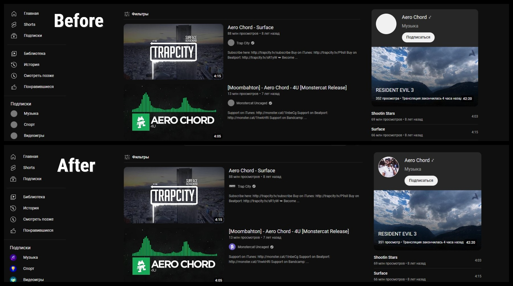

# Описание
Расширение для исправления серых аватарок на ютубе

# Установка
## В качестве расширения для Google Chrome
В Хроме Настройки-> Расширения->Сверху справа включаем режим разработчика.
Должна появиться кнопка "Загрузить распакованное расширение". Нажимаем на неё, указываем папку "GoogleExtension". Profit